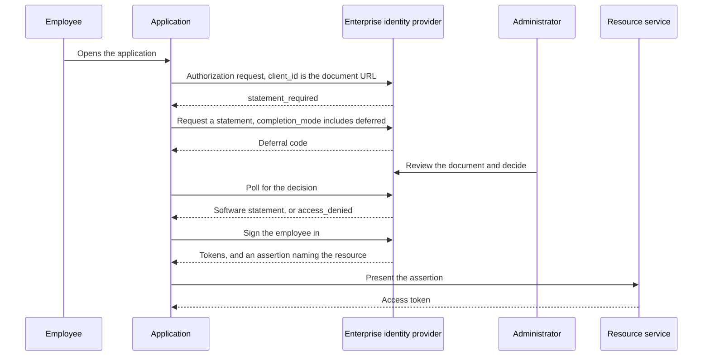

# Sketch: Tenant Admin Consent Without a Stored Grant

Tenant-wide admin consent is the most widely deployed enterprise authorization ceremony that no open standard describes. This sketch takes Microsoft Entra ID's version as the reference, because it is the one most people mean, and asks what each of its parts looks like built from specifications instead. It is non-normative and it is not a draft.

The short version: three of its four parts have generic forms already, one of them better than the original. The fourth has no form anywhere, and this sketch argues that is the correct outcome rather than a gap to fill.

## What the ceremony actually does

Four parts, worth separating because they are usually discussed as one act.

| Part | In Entra |
| --- | --- |
| The app becomes known to the tenant | A `servicePrincipal`, created when some user first consents, or created disabled when a reviewer blocks a request |
| Someone asks, an administrator decides | An `appConsentRequest` fanning out to `userConsentRequest` objects, reviewers notified by email, statuses running `Initializing`, `InProgress`, `Expired`, `Completed` |
| The decision is recorded | An `oauth2PermissionGrant` with `consentType` of `AllPrincipals` and a null `principalId` for delegated permissions, an `appRoleAssignment` for application permissions |
| It is withdrawn | The grant row is deleted |

Two properties of that shape matter more than any of the parts.

**The approval loop cannot be automated.** Microsoft's documentation states it plainly in both the v1.0 and beta API references: there are no methods to programmatically approve or deny a request, and the contents of a request can only be used to reconstruct a URL that grants consent through a browser. The `/adminconsent` endpoint returns no code and no token, only `admin_consent=True` with a `tenant` value the documentation warns must never be used to authenticate or authorize. So the step an enterprise most wants in a pipeline is the step that requires a human in a browser.

**The record is permanent and local.** A grant does not expire, nobody re-reviews it, and deleting it does not reach tokens already issued: existing access tokens remain valid for their lifetime, and only new ones are refused. Revocation is also not sticky, since users can re-consent afterwards. The grant is verifiable only inside the directory that holds it.

## The architectural difference

Admin consent is a **stored, permanent, tenant-local record**. What these drafts describe is a **decision evaluated at every grant**. Everything below follows from that one difference.

## Mapping the parts

| Part | Generic form | Status |
| --- | --- | --- |
| App known to the tenant | A Client ID Metadata Document URL that resolves. No provisioning step exists to precede the request | Available |
| Ask and decide | The issuance flow: an authorization request with `completion_mode` including `deferred`, a `software_statement_code`, redemption returning a deferral code, polling, then a statement or a terminal `access_denied` | Available, and machine-readable |
| Record the decision | A software statement: an issuer, an expiry, a digest binding it to the exact document reviewed, and a status reference for withdrawal | Available |
| Consent for all users, permanently | Nothing, anywhere. See below | Deliberately absent |
| Withdraw | Set the statement's status, and stop renewing | Available |

### The bootstrap inverts

Entra needs the app provisioned in the tenant before an administrator can consent, which usually means a user consented first. That ordering is why "grant admin consent" is a second act rather than the first one.

A client identified by a Client ID Metadata Document needs no provisioning. Its identifier is a URL that resolves to its metadata, so it can ask for admission before anyone has consented to anything, and an administrator can approve software no user has yet touched. Who moves first is no longer forced.

### The ceremony is already specified

The request-and-approve loop maps onto the issuance draft almost part for part, and comes out ahead in the one place it counts. Entra's workflow tracks state and notifies reviewers but terminates in a browser. The issuance flow terminates in a token response the client polled for, with a defined denial that is terminal for the request and does not preclude asking again later.

That is the difference between a ceremony a person completes and a ceremony a program completes.

### The decision becomes an artifact worth auditing

An `oauth2PermissionGrant` is a row. It says a grant exists, not who decided, against what, when it lapses, or whether it still stands. A statement carries the issuer, an expiry the reviewer chose, and a digest naming the exact bytes of the document that was approved, so a later reader can tell whether the software still matches what was reviewed. Withdrawal is a published status any relying party can resolve rather than a deletion visible only to the directory that performed it.

For an enterprise with more than one vendor, that last property is the point. The same decision is checkable at every provider that trusts the reviewer, which is the case the deployment model opens on.

## The part with no generic form

Nothing in any open specification expresses a consent that binds a population rather than a principal. `consentType: AllPrincipals` has no analog in OAuth 2.0, OpenID Connect, Rich Authorization Requests, CIBA, OpenID Federation, or the OpenID Foundation's Grant Management for OAuth 2.0, which is client-initiated and scoped to a resource owner.

The two nearest efforts both miss it, in ways worth knowing:

* **`draft-dellaert-oauth-approval-based-dcr`**, an individual draft at revision `-00` with no working group adoption, applies the device-flow shape to registration. It approves a *client registration* rather than a *consent*, and leaves the approver's identity and trust model to server policy. There is no notion of approving on behalf of a population.
* **The AuthZEN Access Request and Approval Profile**, an adopted OpenID AuthZEN working group draft, models request then approve for an *access* decision: a denial carries an access request, the enforcement point submits one, polls a status, and re-evaluates on approval. It states outright that it does not define a workflow engine, approval policy, or approver-facing surface, and it leaves who may approve for whom to the access request service.

So that profile and this family are complementary rather than competing. One is "a user needs access and an approver decides." The other is "software needs admission and a reviewer decides." Neither expresses a decision covering everybody, and neither should.

## Why the absence is right

A permanent grant covering every user in an organization, which nobody re-reviews and whose revocation does not reach issued tokens, is the artifact enterprises then buy a second product to inventory and attest. Standardizing it would spread that shape rather than fix it.

The generic answer is to stop needing it. Admission is a decision with an expiry, so it lapses unless somebody renews it. What a user may access is decided at each grant, and where the enterprise identity provider mediates, its willingness to issue an assertion carries the tenant's permission continuously. Ceasing to issue stops new grants at once, which is faster than deleting a row and waiting out token lifetimes.

The scope question needs no artifact either. The reviewed document's `scope` is already a ceiling, since a request outside it fails with `invalid_scope`. Where a server places consent inside that ceiling, and whether it prompts a user at all, is its own policy and is the right thing to leave alone.

## The flow

## What this does not replace

* **Placing consent so users are not prompted.** That is what admin consent is usually bought for, and it stays local policy at the authorization server. Nothing here tells a server when to skip a consent screen.
* **Assigning users and groups to an application.** Entra treats that as a separate control from consent, and it stays separate here, on the identity provider's side.
* **Application permissions with no user.** An `appRoleAssignment` to a service principal is an app-only grant. The family admits the software and says nothing about what it may do without a user, which the deployment model already names as the case it serves least well.
* **Anything retroactive.** Like Entra, withdrawal does not invalidate tokens already issued. Unlike Entra, the window is bounded by a status resolution interval rather than by whenever someone notices.

## Open questions

* **Does an administrator approving software need a different artifact from a marketplace reviewing it?** This sketch says no, and treats the enterprise as a reviewer that happens to serve one tenant. The counter-argument is that a marketplace attests quality while an administrator accepts risk, and those may deserve different claims.
* **Where does per-user assignment belong** when the identity provider is also the reviewer? Today the assertion carries it implicitly, and nothing makes the two decisions distinguishable in an audit.
* **Should a denial be durable?** Entra's Block creates a disabled service principal and prevents future requests, while a plain Deny lets the requester ask again. The issuance draft's terminal denial binds one request only, which is deliberate, but an administrator who has said no may expect that to stick.
* **Nothing here helps an enterprise migrate.** An organization with thousands of existing consent grants has no path from a directory of rows to a set of expiring decisions, and building one is not a protocol question.
