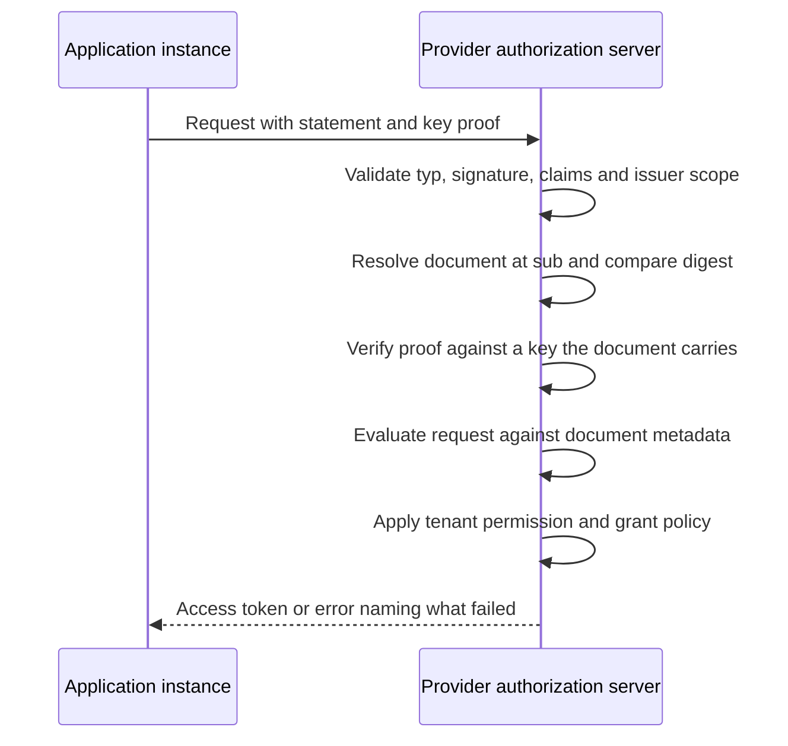

# Deployment Model: Portable Review Across Many Authorization Servers

This is a non-normative companion to the three drafts in this repository. It sketches one end-to-end deployment, names the actors, and shows which part of each draft carries which decision. Nothing here is normative; where this document and a draft disagree, the draft wins.

* [CIMD Software Statement](draft-mcguinness-oauth-cimd-sw-stmt.md), the statement draft: the artifact, its validation, issuer trust, and the two points at which a statement is consumed.
* [CIMD Software Statement Issuance](draft-mcguinness-oauth-cimd-sw-stmt-issuance.md), the issuance draft: how a client obtains one.
* [Shared Signals Events for CIMD Software Statements](draft-mcguinness-oauth-cimd-sw-stmt-signals.md), the signals draft: telling a provider that a status changed, so it resolves sooner than its schedule would. Optional to both.

## The situation being addressed

An enterprise runs software from many vendors. Its people install software the enterprise did not procure. Vendor-hosted applications connect to other vendor-hosted applications on its behalf. Every one of those connections is an OAuth client at some authorization server, and there are many authorization servers.

Two review functions are at work, and they are routinely conflated:

* A provider's marketplace decides which software may exist as a client on its platform. It runs a listing process with security review, branding checks, and a contract.
* A customer decides which of that software may operate in its tenant. It runs procurement, security review, and a data-protection assessment.

Neither substitutes for the other. **These drafts carry the first.** The second is answered on the customer's own clock, and where the customer's identity provider mediates the grant it is already answered continuously, by whether that provider issues an assertion at all. Trying to carry both in one artifact was the design this family started from and abandoned; the reasons are in [Composition with ID-JAG](#composition-with-id-jag).

## What is actually new here

Three capabilities have no incumbent answer, and all three are provider-side:

* **Registrations whose metadata cannot be self-asserted.** A registration made with a statement takes its metadata from the reviewed document, not from the request. The redirect URIs, keys, and branding on the registration are the ones an issuer looked at.
* **Registrations that expire when the decision behind them expires.** No provider offers this today, and no amount of customer-side automation creates it.
* **Admission without registration.** A sender-constrained presentation establishes a client for one request and leaves no record, which is the only workable shape for client populations too numerous or too short-lived to register.

The customer-side story is worth stating plainly: a determined enterprise can already hold one approval record and drive each provider's administrative API from it, unilaterally, today. What it cannot get that way is a decision the provider verifies rather than trusts, registration metadata bound to a review, or expiring registrations.

A provider can adopt this in two rungs and needs no counterparty for the first. It issues statements from its own listing program, consumes them under the registration-validity model, and gets delistings that actually take effect. Then it accepts runtime presentation at the token endpoint for clients that need no redirect, which asks listed publishers only to host a metadata document.

## Four layers

| Layer | Question | Decider | Artifact | Lifecycle |
| --- | --- | --- | --- | --- |
| Establishment | Which software may exist as a client here? | A reviewer the provider trusts | Software statement | Review and renewal |
| Tenant permission | Which established software may operate in my tenant right now? | The customer | Whether its identity provider issues an assertion | Per grant |
| Presenter proof | Which instance is making this request? | The reviewed document, which carries the key that must be proven | Client authentication or DPoP | Per request |
| User grant | What may it access, for whom? | Resource owner and local policy | Access grant, or a cross-domain identity assertion | Grant and token lifetime |

The drafts define the establishment layer. Presenter proof is ordinary OAuth client authentication against a key the reviewed document carries; tenant permission and the user grant belong to the customer's identity provider and to OAuth itself.

## Actors

| Actor | Holds | Issues or presents |
| --- | --- | --- |
| Software publisher | The software's identity, a Client ID Metadata Document URL | Publishes the document; obtains statements over it |
| Reviewer | A review process: a marketplace listing program, an ecosystem directory, or an enterprise's own | Statements naming the software, the reviewed digest, and where they may be used |
| Provider authorization server | Registrations, trust configuration | Validates statements, resolves documents, registers or establishes clients |
| Enterprise customer | Its permission decision, and optionally a review process of its own | Assertions for permitted applications; statements where it wants a portable review record |
| Client instance | A key the reviewed document carries | Proves that key at request time |

## End to end

### 1. The publisher gives the software an identity

A Client ID Metadata Document at an HTTPS URL: domain-anchored, retrievable, and bindable to its exact bytes. Software that cannot host one is outside this family and registers as it does today.

### 2. A reviewer evaluates the document and issues a statement

The reviewer fetches the document, evaluates it, and signs a statement naming the software as `sub`, the digest of the exact bytes it reviewed as `cimd_digest`, the servers where the review should hold as `aud`, and an expiry reflecting how often it re-checks. The statement carries no metadata of its own: the document is the metadata, and the digest says which version of it was reviewed.

### 3. The application registers, or does not

Registering, the application presents the statement in an ordinary RFC 7591 request. The provider resolves the document at `sub`, verifies its digest against the statement, and registers the client with **that document's** metadata, taking nothing from the request. Where the provider implements the registration-validity model, it records the statement's identity and an effective expiry, the earlier of the statement's own and the maximum lifetime the provider honors for that issuer, and the registration is valid until then. One registration serves every tenant on the platform, so onboarding a customer requires no new registration.

Not registering, an application identified by its metadata URL presents the statement in a token request or a pushed authorization request, proves a key the reviewed document carries, and is established for that request alone.

### 4. The customer decides which software may operate in its tenant

A different decision, on a different clock, which the drafts deliberately do not carry. Where the customer's identity provider mediates the grant it is already answered: the provider issues an assertion for applications the customer permits and none for the rest, so enforcement happens at every grant and withdrawal takes effect at the next one.

A customer that wants its review to travel as an artifact, because it needs an auditable record or because the provider is reached without its identity provider in the path, operates a reviewer of its own and appears to providers as any other reviewer.

### 5. The provider configures the reviewers it trusts

Once per reviewer: the issuer identifier, its key source, the signing algorithms accepted from it, the client identifier namespaces it may speak for, the audiences it may name, a maximum statement lifetime, and a policy on multiple registrations from one statement. That is the entire per-reviewer cost, and it does not recur per application.

### 6. A request arrives

Everything that needs no network happens before the document is fetched, which keeps an unauthenticated request from spending retrieval on a statement that was never going to validate.

### 7. Renewal

A client renews by presenting its current statement back to the reviewer, which re-evaluates the document and issues a replacement. No separate credential is involved, so automated renewal does not depend on an out-of-band token outliving every statement it renews.

Delivering the replacement extends the registration: the provider resolves the document the replacement names, verifies its digest, and re-derives the registration's metadata, so a narrowing in the document takes effect at renewal rather than waiting for the next full registration.

### 8. Offboarding

The reviewer stops renewing. At the recorded expiry the registration lapses where the provider implements registration validity, and new presentations stop everywhere. Existing access winds down as tokens expire and, where refresh requires a current statement, as refresh fails.

Where the customer's identity provider carries the permission, the customer stops issuing assertions and new grants stop at once, with the vendor's listing untouched and other customers unaffected.

Neither revokes tokens already issued. A provider wanting an immediate stop uses its own controls, and narrows the window by resolving statement status more often.

## Variants

**Vendor-hosted multi-tenant SaaS.** The common case. One client, one registration, many tenants, with each customer's permission expressed on its own side per grant rather than as an overlay the provider stores.

**Customer-deployed software.** Each installation registers, and one statement can govern several registrations, subject to the provider's bound on how many it derives from one statement.

**Employee-installed public software.** The publisher hosts the document and holds a statement; whether that software reaches a given tenant is the customer's decision. The hard part is the proof: a key shipped inside a distributed binary is in every copy, so it identifies the software but not the installation. Runtime presentation admits only a key the reviewed document carries, so such software registers per installation instead. Admitting an instance's own key, through an attester or a delegation the document names, is an extension the statement draft points at rather than defines.

**Application to application.** No user is present, so no identity assertion carries a customer's permission. The application establishes itself and proves its key, and the customer's permission has to be expressed at the provider by other means. This is the case the family serves least well, and it is worth naming rather than hiding.

**Managed and unmanaged devices.** No draft addresses device posture. Its natural home is the proof layer, where an attestation scheme can carry device signals if it defines them; the review layer stays device-independent.

## Composition with ID-JAG

[The OAuth Identity Assertion Authorization Grant](https://datatracker.ietf.org/doc/draft-ietf-oauth-identity-assertion-authz-grant/) carries a user's authority across domains: the enterprise identity provider signs an assertion that a client exchanges at another provider's authorization server for an access token.

One act carries two decisions. The assertion says this user, at this enterprise, authorizes this client at this target, and its existence says the enterprise permits that client at all, since an application the customer has not permitted receives no assertion. Both are checked at every grant, and both are withdrawn by ceasing to issue. That is why the enterprise case needs no artifact of its own, and why this family stopped trying to give it one.

[Issue #121](https://github.com/oauth-wg/oauth-identity-assertion-authz-grant/issues/121) proposes an optional `cimd_digest` claim in the assertion the identity provider already signs, letting the target resolve the client's document, compare the digest, and provision just in time with no registration to govern. The two mechanisms answer different questions and stay distinct:

* The assertion-carried digest binds metadata. It says the identity provider expects this client to be the software published at that URL. It carries no review, no expiry of its own, and no audience.
* A statement carries a review. A named reviewer evaluated a specific document and vouched for it, with an expiry and an audience, which is what a deployment needs when it wants an auditable record rather than a policy decision inside an identity provider.

They compose, and a deployment needing only the first can stop there and never touch these drafts.

**Enforcement cadence.** An assertion is validated at every grant, so ceasing issuance stops new grants at once. Statement expiry works on a slower clock, taking effect at the next presentation, the registration validity boundary, or a refresh where a current statement is required. An enterprise offboarding an application uses whichever levers it holds.

## Composition with Shared Signals

A statement is carried by the client it admits, and a client has no reason to stop presenting one, so ending a review early needs somewhere a provider can check. That place is the reviewer's status list. Statements can carry a `status` claim locating them in it, per [Token Status List](https://datatracker.ietf.org/doc/draft-ietf-oauth-status-list/), and a provider resolves that status on its own schedule. Withdrawing a review is then a matter of setting one entry, and one signed list answers for every statement the reviewer has issued.

What remains is latency. A provider resolving hourly learns of a delisting within the hour. Shortening that for everyone means everyone polls harder, and nearly every poll reports no change.

The signals draft closes that gap over the [Shared Signals Framework](https://openid.net/specs/openid-sharedsignals-framework-1_0-final.html). The reviewer transmits, the authorization server receives, events travel as [Security Event Tokens](https://www.rfc-editor.org/rfc/rfc8417.html), and subjects use the `uri` format of [RFC 9493](https://www.rfc-editor.org/rfc/rfc9493.html). Nothing new is invented at the transport or trust layer.

One event, carrying no decision:

| Event | Meaning | What the receiver does |
| --- | --- | --- |
| Status changed, naming a `jti` | The status of one statement moved | Invalidate any cached status list, resolve that statement now, apply what the list says |
| Status changed, naming none | Some statement for this software moved | The same, across the statements it holds for that subject and issuer |

Two properties keep this additive. **The event names no status.** It says look, not what to conclude. A forged or replayed event costs a resolution and cannot assert a withdrawal the reviewer never published, so the list stays the single authority, and a receiver that resolves `VALID` after an event has applied that event correctly.

**Missed events fall back to the schedule.** A lost stream leaves the deployment where it would have been without the mechanism: the provider resolves status on its ordinary cadence, and failing that, standing ends at expiry. Signals shorten the interval between a decision and its effect and carry no state of their own, which is why neither other draft depends on them.

The consequence is that cadence and responsiveness stop being one dial. A reviewer picks a resolution interval that suits its consumers and still acts in seconds when it must.

## What each draft supplies

| Capability | Draft | Section |
| --- | --- | --- |
| Statement format, claims, digest | Statement | The Software Statement |
| Validation a consumer performs | Statement | Validating a Statement |
| Issuer trust and scoping | Statement | Issuer Trust Establishment |
| Document-authoritative registration, validity, renewal | Statement | Consumption at Registration |
| Establishment without registration | Statement | Runtime Presentation |
| Presenter binding | Statement | Sender Constraint |
| Discovery | Statement | Authorization Server Metadata |
| How a client obtains a statement | Issuance | Authorization Request, Token Exchange Profile, Deferred Processing |
| Renewal from a prior statement | Issuance | Renewal |
| Ending a review before expiry | Statement, Issuance | `status` claim, Status Publication |
| Reducing withdrawal latency | Signals | Status Changed, Receiver Processing |

## What changes, concretely

| Today | With these drafts |
| --- | --- |
| A registration's metadata is whatever the client asserted | It is the document a named reviewer evaluated, byte for byte |
| Registrations are permanent | Validity is the reviewed decision's expiry, renewed while the review stands |
| Delisting means finding every registration | It means ceasing renewal, or transmitting one event |
| Every provider re-runs the same review | One review is verified at every provider that trusts the reviewer |
| Admitting a client means registering it | A client too numerous or short-lived to register can be established per request |

## Operational realities

**Who runs the reviewer.** It is an authorization server role, not a new system. For a marketplace it is part of the listing program; for an enterprise that wants a portable record it is naturally whoever runs the identity provider. An enterprise that wants neither keeps using each provider's console, and nothing else here changes.

**Availability moves into the path.** Statements renew on a schedule, so a reviewer's outage longer than the remaining lifetime lapses every statement it maintains at once. Lifetimes of days rather than minutes, staggered expiries, and renewal ahead of the boundary keep that from being a self-inflicted outage. Registration and presentation also resolve the client's document, so the document host's availability matters at consumption time.

**Coexisting with what exists.** Nothing requires a provider to remove its console. A provider consuming statements alongside its own toggles applies both, and the narrower answer governs. A practical migration runs the statement path in parallel, compares its decisions against the console for a cycle, and only then makes the console the exception path.

## What these drafts do not solve

* **Immediate revocation.** Enforcement is bounded by the provider's status resolution interval, the statement lifetime behind it, and the provider's own controls. Status resolution narrows the window to that interval; the signals profile narrows it to delivery latency. Neither reaches tokens already issued.
* **Software that cannot host metadata.** The family requires a Client ID Metadata Document. Software without one registers as it does today and gets none of this, which is a deliberate boundary.
* **Discovery of policy.** There is no in-band way to learn which reviewers a provider accepts. Trust configuration is deliberately out of band, and error responses guide the client.
* **Delegation.** These drafts establish what the client is and whether a reviewer vouched for it. Which user or organization it acts for is separate work; see [Composition with ID-JAG](#composition-with-id-jag).
* **Device posture.** Not addressed, and placed at the proof layer here only as guidance.
