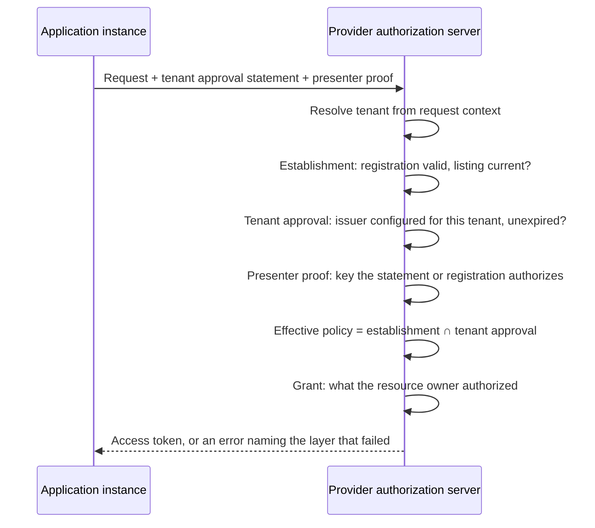

# Deployment Model: Marketplace Listing and Enterprise Approval

This is a non-normative companion to the three drafts in this repository. It sketches one end-to-end deployment, names the actors, and shows which part of each draft carries which decision. Nothing here is normative; where this document and a draft disagree, the draft wins.

* [OAuth 2.0 Software Statement Issuance](draft-mcguinness-oauth-software-statement-issuance.md), referred to below as the issuance draft.
* [OAuth 2.0 Software Statement Consumption and Runtime Presentation](draft-mcguinness-oauth-sw-stmt-presentation.md), referred to below as the consumption draft.
* [Shared Signals Events for OAuth Software Statements](draft-mcguinness-oauth-sw-stmt-signals.md), referred to below as the signals draft, which is optional to both.

## The situation being addressed

An enterprise runs software from many vendors. Its people install software the enterprise did not procure. Devices are a mix of managed and unmanaged. Vendor-hosted applications connect to other vendor-hosted applications on the enterprise's behalf. Every one of those connections is an OAuth client at some authorization server, and there are many authorization servers.

Today the enterprise expresses "these applications are allowed" once per provider, in whatever the provider's console or administrative API offers. Each list is a separate copy of the same decision, in a different format, with no expiry, and each is only as trustworthy as the credentials of whatever automation writes it. Removing an application means finding every copy. Providers face the mirror problem: each must decide what to enable by default for a new customer, and has no way to learn what that customer already approved elsewhere.

Two review functions are at work, and they are routinely conflated:

* The provider's marketplace decides which software may exist as a client on its platform. It runs a listing process with security review, branding checks, and a contract.
* The customer decides which of that software may operate in its tenant. It runs procurement, security review, and a data-protection assessment.

Neither substitutes for the other. An application can be listed on a marketplace and unwelcome at a particular customer, and a customer can approve software its provider has never reviewed.

## What is actually new here

Two capabilities in this family have no incumbent answer, and both are provider-side:

* **Registrations that expire when the decision behind them expires.** No provider offers this today, and no amount of customer-side automation creates it.
* **Admission of clients without registering them.** A sender-constrained presentation establishes a client for a request and leaves no record, which is the only workable shape for client populations that are too numerous or too short-lived to register at all.

The customer-side story is different, and worth stating plainly: a determined enterprise can already hold one approval record and drive each provider's administrative API from it, unilaterally, today. What it cannot get that way is a decision the provider verifies rather than trusts, expiring registrations, or any of this at a provider that offers no such API. The portable approval is worth having, and it is an improvement on scripting rather than a capability that does not exist.

A provider can therefore adopt this in two rungs, and needs no counterparty for the first. It issues statements from its own listing program for the software it lists, consumes them under the registration-validity model, and gets delistings that actually take effect. Then it accepts runtime presentation at the token endpoint for clients that need no redirect, which asks listed publishers only to host a metadata document. Tenant approval, the layer that requires a second party, comes after both.

## Four layers

| Layer | Question | Decider | Artifact | Lifecycle |
| --- | --- | --- | --- | --- |
| Establishment | Which software may exist as a client here? | Provider, through its marketplace | Establishment statement | Listing review and renewal |
| Tenant approval | Which established software may operate in my tenant? | Customer | Tenant approval statement | Customer review and renewal |
| Presenter proof | Which instance is making this request? | The statement, which fixes the accepted proof; the provider, which configures any attester it trusts | Client authentication, DPoP proof, client attestation, instance assertion | Per request |
| User grant | What may it access, for whom? | Resource owner and local policy | Access grant, or a cross-domain identity assertion | Grant and token lifetime |

The consumption draft keeps these apart rather than collapsing them into one decision. Establishment and tenant approval are distinguished by the role in which an authorization server accepts an issuer, which the issuance draft defines under Issuer Roles; the wire carries at most one statement per request.

## Actors

| Actor | Holds | Issues or presents |
| --- | --- | --- |
| Software publisher | The software's identity, a Client ID Metadata Document URL or an `software_id` | Publishes metadata; obtains statements |
| Marketplace | The provider's listing process | Establishment statements, audience naming the provider's authorization servers |
| Provider authorization server | Registrations, tenants, trust configuration | Consumes statements; enforces all four layers |
| Enterprise customer | Its own approval process | Tenant approval statements, audience naming the providers it uses |
| Client instance | A key, and possibly an attestation | Presents proof at request time |
| End user | Consent | Authorizes access |

## End to end

### 1. The publisher gives the software an identity

Hosted metadata at an HTTPS URL is the stronger option: the identity is domain-anchored, the metadata is retrievable, and a statement can bind to its exact bytes through `cimd_digest`. Software without hostable metadata uses the issuance draft's registration-only shape, whose subject is an `software_id`.

### 2. The marketplace reviews and issues an establishment statement

The marketplace evaluates the software once and signs a statement naming the software as `sub`, the provider's authorization servers as `aud`, the reviewed metadata as claims, and an expiry that reflects how often it re-checks. The issuance draft defines the format, the flows for obtaining one, and the digest that binds the review to the exact metadata evaluated.

### 3. The application registers once

The application registers at the provider, carrying the establishment statement. Where the provider implements the registration-validity model and advertises it, which the consumption draft makes optional, it records the governing statement's identity and expiry with the registration, so the registration is valid for as long as the listing is current. A provider that does not implement it consumes the statement as ordinary registration input and its registrations remain permanent. That single registration serves every tenant on the platform, so onboarding a customer requires no new registration. Platforms already do this today without a signed artifact; what the statement adds is a listing decision the provider can verify and expire, which matters most when the listing authority is not the provider itself.

Where the application has no registration and is identified by its metadata URL, it can instead be established at request time by presenting its statement, with no persistent record created.

### 4. The customer approves the application

The enterprise reviews the application through its own process and its issuer signs a tenant approval statement: `sub` names the application, `aud` names the providers where the approval should hold, attested claims narrow what the enterprise approved, and the expiry sets how long the approval stands without renewal.

This is one decision, made once, in the enterprise's own system of record.

Getting it to a provider is one step, and after it the customer's system stays the source of truth. The customer publishes its approvals and the provider retrieves them. The application carries nothing, which is what keeps a vendor from needing an OAuth relationship with every customer's issuer, and it keeps the customer's decision in the customer's hands: an approval ends by ceasing to be served, with no artifact in circulation that outlives it. A provider that cannot retrieve, or a customer that has not set retrieval up, falls back to the administrator recording the statement once through the provider's interface.

The reason approvals are not carried, while listings are, is worth stating: an artifact that grants may be conveyed by the party it grants to, whose incentive is to convey it faithfully, and an artifact that restricts must not be, because the restricted party would then control whether the decision is ever seen. The second path is closest to how consoles work today and is the practical migration route; the first suits software the customer runs itself.

### 5. The customer onboards a provider

At each provider, the enterprise configures its issuer once: the issuer identifier, the tenant approval role, the identifier scope, the metadata the provider will treat it as authoritative for, and a maximum lifetime. The provider also configures whatever attester trust the applications' proof modes require, and the tenant decides whether it will require approval statements at all. Adding a provider does not require re-entering the application estate by hand, but approvals name their audiences, so statements issued before that provider existed do not name it and become usable there as the issuer's next renewal cycle includes it.

Where the provider already trusts the enterprise identity provider for single sign-on or for cross-domain assertions, this adds a role to an existing relationship rather than establishing a new one ([Composition with ID-JAG](#composition-with-id-jag)).

### 6. A request arrives

The provider resolves the tenant the request belongs to, then evaluates the layers in order:

Tenant approval constrains the request and does not establish the client: it cannot create a registration, alter one, or extend its validity, and its attested metadata narrows without widening. A tenant that prefers a console toggle to an artifact keeps the toggle; the statement is how a decision made once travels to providers the enterprise onboards later.

### 7. Two renewal loops, running independently

The marketplace renews listings on its own cadence. The enterprise renews approvals on its own. Neither party has to know the other's schedule, and an application's standing at a provider is the conjunction of two currencies that are maintained separately.

### 8. Offboarding

The enterprise stops serving an application's approval. At the next retrieval, or at expiry where the provider records rather than retrieves, the application stops making new requests in that enterprise's tenant, at every provider where the enterprise configured its issuer, with no console visits. Existing grants stop refreshing only where the provider evaluates tenant approval on refresh, which the consumption draft requires for tenants that require approval; providers that do not are left with grants that continue until their refresh tokens expire. The vendor's listing is untouched and every other customer is unaffected.

The marketplace stops renewing a listing. The registration expires at the provider, and the application stops working for everyone there.

Neither revokes tokens already issued. Access winds down as those tokens expire and, where refresh is gated on currency, as refresh fails; a provider that wants an immediate stop uses its own local controls, which it retains throughout. Both levers are bounded by lifetime unless the provider also consumes the signals draft's events.

## Variants

**Vendor-hosted multi-tenant SaaS.** The common case. One client, one registration, many tenants. Tenant approval is the per-customer overlay, evaluated in the tenant context of each request.

**Customer-deployed software.** The customer installs and runs the software itself. Each installation registers, and the same establishment statement can govern many registrations, subject to the provider's limits on how many it derives from one statement. Software with no hostable metadata document is outside this family and registers as it does today.

**Employee-installed public software.** The publisher hosts the metadata and holds a statement; the enterprise decides whether that software may reach its tenants. The hard part is the presenter proof: a key shipped inside a distributed binary is present in every copy, so it identifies the software but not the installation. Runtime presentation admits only a key the statement attests, so such software registers per installation instead; admitting an instance's own key through an attester or an attested delegation is named as an extension rather than defined.

**Application to application.** No user is present. The calling application establishes itself as a client, presents tenant approval for the customer it is acting for, and proves its key. Who it acts on behalf of, as opposed to what it is, belongs to delegation mechanisms outside these drafts.

**Managed and unmanaged devices.** None of the drafts addresses device posture. Its natural home is the presenter-proof layer, where an attestation scheme can carry device signals if it defines them, rather than either review layer: approval stays device-independent, and posture is enforced where the request is made.

## Composition with ID-JAG

[The OAuth Identity Assertion Authorization Grant](https://datatracker.ietf.org/doc/draft-ietf-oauth-identity-assertion-authz-grant/), ID-JAG, carries a user's authority across domains: the enterprise identity provider signs an assertion that a client exchanges at another provider's authorization server for an access token. It answers the user-grant layer for cross-domain requests, and it composes with the review layers rather than replacing them.

The same enterprise infrastructure can sign both artifacts, which is what makes this practical:

| Artifact | What it asserts | Layer | Checked |
| --- | --- | --- | --- |
| ID-JAG assertion | This user, at this enterprise, authorizes this client at this target | User grant | At every grant |
| Tenant approval statement | This enterprise approves this software for its tenant | Tenant approval | While unexpired, at presentation or delivery |

ID-JAG makes the identity provider's word about people portable; a software statement makes its word about software portable. The wiring is shared, the authority is not: a provider that already trusts the enterprise identity provider as an assertion issuer is being asked, when it also configures that issuer in the tenant approval role, to accept its word about something new. The relationship exists; the authority is an explicit additional decision, and configuring one role does not imply the other.

### Per-grant metadata binding

Where a deployment wants the client's metadata checked on every grant rather than through a separate approval lifecycle, [issue #121](https://github.com/oauth-wg/oauth-identity-assertion-authz-grant/issues/121) proposes an optional `cimd_digest` claim in the assertion the identity provider already signs. The target authorization server resolves the client's metadata document, compares the digest, and can provision the client just in time, with no prior registration and no separate artifact to obtain, renew, or deliver.

The two mechanisms answer different questions and are worth keeping distinct:

* The assertion-carried digest binds metadata. It says the identity provider expects this client to be the software published at that URL. It carries no review semantics, no attested member set, no audience of its own, and no approval lifecycle.
* The tenant approval statement carries a decision. It says a named authority reviewed the software and approves it for a tenant, with an expiry, an audience, and an attested member set the provider can intersect against.

They compose: an assertion-carried digest can establish a client just in time while a tenant approval statement, or the provider's own console toggle, still decides whether that client may operate in the tenant. Deployments that need only "this client is who the identity provider says it is" can stop at the digest.

### Enforcement cadence

Because an ID-JAG assertion is validated at every grant, ceasing assertion issuance stops new grants at once, with existing access winding down as tokens expire. It is the sharpest lever available, and it reaches only the grants that traverse ID-JAG; the authorization-code and refresh traffic in the walkthrough above does not, and is governed by the approval and signal mechanisms instead. Statement expiry works on a slower clock: it governs the currency of establishment and approval, and takes effect at the next presentation, registration validity boundary, or refresh where a current statement is required. An enterprise offboarding an application uses both, stopping assertions to end new grants immediately and stopping approval renewal so the application lapses everywhere at its recorded expiry.

## Composition with Shared Signals

Approvals that a provider retrieves end by absence, so nothing more is needed for them. Establishment statements are different: a client carries one and has no reason to stop, so withdrawing a listing before its expiry is enforced on a clock. An approval or a listing ends when its statement expires unrenewed, so how fast a decision takes effect is set by how short the issuer made the lifetime, and short lifetimes buy responsiveness with renewal traffic. That trade is avoidable: the parties are already in a configured pairwise relationship, since a trusting authorization server holds each issuer's identifier, keys, scope, and role, and that same relationship can carry an event stream.

[Shared Signals Events for OAuth Software Statements](draft-mcguinness-oauth-sw-stmt-signals.md), the third draft in this repository, defines those events over the [Shared Signals Framework](https://openid.net/specs/openid-sharedsignals-framework-1_0.html). The statement issuer is the transmitter, the trusting authorization server is the receiver, events travel as [Security Event Tokens](https://www.rfc-editor.org/rfc/rfc8417.html) over the framework's push or poll delivery, and subjects use the [identifier formats of RFC 9493](https://www.rfc-editor.org/rfc/rfc9493.html): the `uri` format for a Client ID Metadata Document URL, and `iss_sub` for an `software_id` under the issuer that names it. Nothing new is invented at the transport or trust layer; the profile's work is naming events and their effects.

Four events carry the semantics this deployment needs:

| Event | Meaning | Layer | Effect and blast radius |
| --- | --- | --- | --- |
| Statement revoked | This artifact, by `jti`, is no longer good | Whichever layer issued it | Refuse that statement before its expiry, durably |
| Approval withdrawn | The tenant no longer approves this software | Tenant approval | Refuse its approval statements and block that tenant's requests now; other tenants and the listing unaffected |
| Establishment withdrawn | The software is no longer established here | Establishment | Refuse its statements and expire the registration early, for every tenant at that provider |
| Metadata changed | The published metadata no longer matches what was reviewed | Advisory | Apply the server's change policy as though it had observed the change; it can add a reason to distrust, never clear one |

Two properties make this safe to add without weakening what is already specified.

Signals can only reduce standing, and the reduction is durable. A receiver records the withdrawal and refuses statements issued at or before it, so a client holding an unexpired statement cannot restore what the event ended; only a statement issued after the withdrawal, which is a fresh decision by the same authority, restores it. No event creates standing, extends a lifetime, or substitutes for a valid statement, so a forged or replayed event cannot grant anything, and the worst outcome of a spurious event is an availability failure the issuer corrects by issuing a later statement.

Missed signals fail closed against the clock. A receiver that loses its stream, or an issuer whose transmitter is down, falls back to exactly the behavior specified today: standing ends at expiry. The bounded lifetime stays mandatory and remains the floor; signals only shorten the interval between a decision and its effect. This is why the two drafts do not depend on the framework, and why they remain implementable without it.

The consequence is that lifetime and responsiveness stop being the same dial. An issuer can choose a lifetime that suits its renewal capacity, days rather than minutes, and still revoke in seconds. Offboarding becomes a signal, with the absence of renewal as the durable backstop for receivers that never got it.

A stream in the other direction, by which a provider reports where an issuer's statements are consumed, would give an enterprise an inventory it cannot get today. It reverses the transmitter and receiver roles and needs its own profile, and the signals draft names it as future work rather than defining it.

The profile is a separate document rather than part of either draft, since it composes with both and neither requires it.

## What each draft supplies

| Capability | Draft | Where |
| --- | --- | --- |
| Statement format, two shapes, digest binding | Issuance | Software Statement Format, Statements for Non-CIMD Clients |
| How a client obtains a statement | Issuance | Authorization Request, Token Exchange Profile, Deferred Processing |
| Issuer trust, scoping, and roles | Issuance | Issuer Trust Establishment, Issuer Roles |
| Per-tenant trust configuration and tenant resolution | Issuance | Issuer Roles |
| Which elements each consumption model needs | Consumption | Statement Profiles |
| Registration validity and renewal | Consumption | Presentation at Registration |
| Runtime establishment without registration | Consumption | Runtime Presentation |
| Presenter binding | Consumption | Sender Constraint |
| Tenant approval evaluation and intersection | Consumption | Tenant Approval |
| Discovery signals | Consumption | Authorization Server Metadata |
| Early withdrawal of a decision | Signals | Event Types, Receiver Processing |

## What changes, concretely

| Today | With these drafts |
| --- | --- |
| One allowlist per provider console, maintained by hand | One approval decision, honored at every provider where the issuer is configured |
| Registrations are permanent | Registration validity is the statement's expiry, renewed while the review stands |
| Offboarding means visiting every console | Offboarding is ceasing renewal at one issuer |
| Marketplace listing and customer approval are conflated or unrelated | Separate issuers, separate roles, separate lifecycles, both enforced |
| Onboarding a provider means re-entering the application estate | Onboarding a provider is one issuer configuration, after which approvals name it as the issuer's renewal cycle reaches them |
| A new application needs per-provider setup | A listed application arrives carrying its listing; the customer's approval arrives with it |

## Operational realities

**Who runs the issuer.** An enterprise issuer is an authorization server role, not a new system to build: the natural operator is whoever already runs the enterprise's identity provider, which is why the composition with ID-JAG matters more than it first appears. An enterprise that does not want to operate one keeps using each provider's console; the tenant approval layer is then expressed locally, and nothing else in this model changes.

**Issuer availability is now in the path.** Approvals renew on a schedule, so an issuer outage longer than the remaining lifetime lapses every approval it maintains, at every provider, at once. Lifetimes of days rather than minutes, staggered expiries, and renewal well ahead of the boundary are what keep that from being a self-inflicted outage; the drafts state the staggering duty on issuers for the same reason.

**Coexisting with what exists.** Nothing here requires a provider to remove its console or an enterprise to abandon its allowlists. A provider consuming statements alongside its own toggles applies both, and the narrower answer governs. A practical migration runs the statement path in parallel, compares its decisions against the console for a cycle, and only then makes the console the exception path.

## What these drafts do not solve

* **Immediate revocation.** As specified, enforcement is bounded by statement lifetime plus the provider's own controls, and shorter lifetimes tighten the loop at the cost of renewal traffic. [Composition with Shared Signals](#composition-with-shared-signals) sketches the profile that would remove that trade; an acceptance-time status claim is the pull-based alternative named in the issuance draft.
* **Identifier trustworthiness for non-hosted software.** A metadata URL is domain-anchored; an `software_id` is a vendor-asserted string. Approvals keyed on the latter are meaningful only within an issuer's enumerated scope.
* **Discovery of policy.** There is no in-band way to learn which issuers a provider accepts, or that a tenant requires an approval. Trust configuration is deliberately out of band, and error responses guide the client.
* **Delegation.** These drafts establish what the client is and whether it is approved. Which user or organization it acts for, and with what authority, is separate work; see [Composition with ID-JAG](#composition-with-id-jag) for the cross-domain case.
* **Device posture.** Not addressed by any of the drafts, and placed at the presenter-proof layer here only as guidance.
