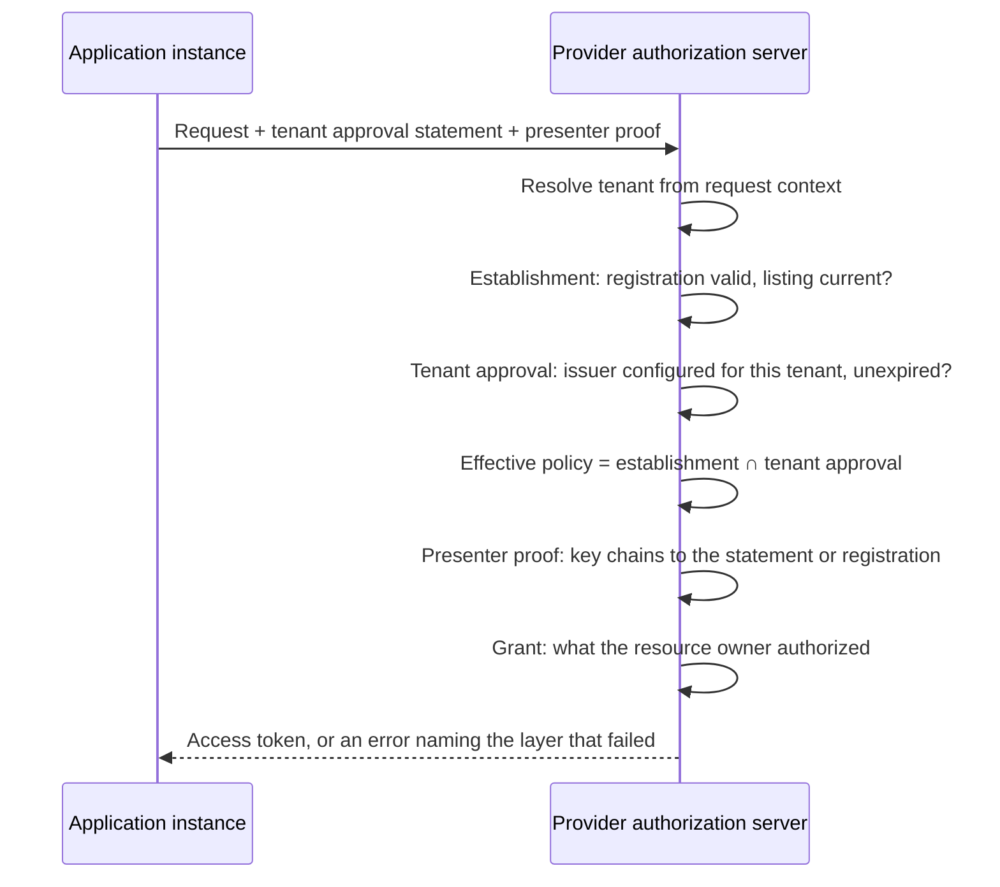

# Deployment Model: Marketplace Listing and Enterprise Approval

This is a non-normative companion to the two drafts in this repository. It sketches one end-to-end deployment, names the actors, and shows which part of each draft carries which decision. Nothing here is normative; where this document and a draft disagree, the draft wins.

* [OAuth 2.0 Software Statement Issuance](draft-mcguinness-oauth-software-statement-issuance.md), referred to below as the issuance draft.
* [OAuth 2.0 Software Statement Consumption and Runtime Presentation](draft-mcguinness-oauth-sw-stmt-presentation.md), referred to below as the consumption draft.

## The situation being addressed

An enterprise runs software from many vendors. Its people install software the enterprise did not procure. Devices are a mix of managed and unmanaged. Vendor-hosted applications connect to other vendor-hosted applications on the enterprise's behalf. Every one of those connections is an OAuth client at some authorization server, and there are many authorization servers.

Today the enterprise expresses "these applications are allowed" once per provider, by hand, in whatever the provider's console offers. Each list is a separate copy of the same decision, in a different format, with no expiry. Removing an application means finding every copy. Providers face the mirror problem: each must decide what to enable by default for a new customer, and has no way to learn what that customer already approved elsewhere.

Two review functions are at work, and they are routinely conflated:

* The provider's marketplace decides which software may exist as a client on its platform. It runs a listing process with security review, branding checks, and a contract.
* The customer decides which of that software may operate in its tenant. It runs procurement, security review, and a data-protection assessment.

Neither substitutes for the other. An application can be listed on a marketplace and unwelcome at a particular customer, and a customer can approve software its provider has never reviewed.

## Four layers

| Layer | Question | Decider | Artifact | Lifecycle |
| --- | --- | --- | --- | --- |
| Establishment | Which software may exist as a client here? | Provider, through its marketplace | Establishment statement | Listing review and renewal |
| Tenant approval | Which established software may operate in my tenant? | Customer | Tenant approval statement | Customer review and renewal |
| Presenter proof | Which instance is making this request? | Cryptography | Client authentication, DPoP proof, client attestation, instance assertion | Per request |
| User grant | What may it access, for whom? | Resource owner and local policy | Access grant | Grant and token lifetime |

The consumption draft keeps these apart rather than collapsing them into one decision. Establishment and tenant approval are distinguished by the role in which an authorization server accepts an issuer, which the issuance draft defines under Issuer Roles; the wire carries at most one statement per request.

## Actors

| Actor | Holds | Issues or presents |
| --- | --- | --- |
| Software publisher | The software's identity, a Client ID Metadata Document URL or an `software_id` | Publishes metadata; obtains statements |
| Marketplace | The provider's listing process | Establishment statements, audience naming the provider's authorization servers |
| Provider authorization server | Registrations, tenants, trust configuration | Consumes statements; enforces all four layers |
| Enterprise customer | Its own approval process | Tenant approval statements, audience naming the providers it uses |
| Client instance | A key, and possibly an attestation | Presents proof at request time |
| End user | Consent | Authorizes access |

## End to end

### 1. The publisher gives the software an identity

Hosted metadata at an HTTPS URL is the stronger option: the identity is domain-anchored, the metadata is retrievable, and a statement can bind to its exact bytes through `cimd_digest`. Software without hostable metadata uses the issuance draft's registration-only shape, whose subject is an `software_id`.

### 2. The marketplace reviews and issues an establishment statement

The marketplace evaluates the software once and signs a statement naming the software as `sub`, the provider's authorization servers as `aud`, the reviewed metadata as claims, and an expiry that reflects how often it re-checks. The issuance draft defines the format, the flows for obtaining one, and the digest that binds the review to the exact metadata evaluated.

### 3. The application registers once

The application registers at the provider, carrying the establishment statement. The provider records the governing statement's identity and expiry with the registration, so the registration is valid for as long as the listing is current. That single registration serves every tenant on the platform. A vendor onboarding a new customer provisions nothing new, which is what makes the marketplace model work at scale.

Where the application has no registration and is identified by its metadata URL, it can instead be established at request time by presenting its statement, with no persistent record created.

### 4. The customer approves the application

The enterprise reviews the application through its own process and its issuer signs a tenant approval statement: `sub` names the application, `aud` names the providers where the approval should hold, attested claims narrow what the enterprise approved, and the expiry sets how long the approval stands without renewal.

This is one decision, made once, in the enterprise's own system of record.

### 5. The customer onboards a provider

At each provider, the enterprise configures its issuer once: the issuer identifier, the tenant approval role, the identifier scope, the metadata the provider will treat it as authoritative for, and a maximum lifetime. That is the entire per-provider cost, and it does not recur per application.

### 6. A request arrives

The provider resolves the tenant the request belongs to, then evaluates the layers in order:

Tenant approval constrains the request and does not establish the client: it cannot create a registration, alter one, or extend its validity, and its attested metadata narrows without widening. A tenant that prefers a console toggle to an artifact keeps the toggle; the statement is how a decision made once travels to providers the enterprise onboards later.

### 7. Two renewal loops, running independently

The marketplace renews listings on its own cadence. The enterprise renews approvals on its own. Neither party has to know the other's schedule, and an application's standing at a provider is the conjunction of two currencies that are maintained separately.

### 8. Offboarding

The enterprise stops renewing an application's approval. At its recorded expiry the application stops working in that enterprise's tenant, at every provider where the enterprise configured its issuer, with no console visits. The vendor's listing is untouched and every other customer is unaffected.

The marketplace stops renewing a listing. The registration expires at the provider, and the application stops working for everyone there.

Neither revokes tokens already issued. Access winds down as those tokens expire, and a provider that wants an immediate stop uses its own local controls, which it retains throughout.

## Variants

**Vendor-hosted multi-tenant SaaS.** The common case. One client, one registration, many tenants. Tenant approval is the per-customer overlay, evaluated in the tenant context of each request.

**Customer-deployed software.** The customer installs and runs the software itself. Each installation registers, and the same establishment statement can govern many registrations, subject to the provider's limits on how many it derives from one statement.

**Employee-installed public software.** The publisher hosts the metadata and holds a statement; the enterprise decides whether that software may reach its tenants. The hard part is the presenter proof: a key shipped inside a distributed binary is present in every copy, so it identifies the software but not the installation. Where per-installation identity matters, the publisher runs an attester or delegates instance attestation to named authorities, and the instance proves its own key.

**Application to application.** No user is present. The calling application establishes itself as a client, presents tenant approval for the customer it is acting for, and proves its key. Who it acts on behalf of, as opposed to what it is, belongs to delegation mechanisms outside these drafts.

**Managed and unmanaged devices.** Device posture belongs to the presenter-proof layer, where a client attestation can carry it, not to either review layer. Approval stays device-independent, and posture is enforced where the request is made.

## What each draft supplies

| Capability | Draft | Where |
| --- | --- | --- |
| Statement format, two shapes, digest binding | Issuance | Software Statement Format, Statements for Non-CIMD Clients |
| How a client obtains a statement | Issuance | Authorization Request, Token Exchange Profile, Deferred Processing |
| Issuer trust, scoping, and roles | Issuance | Issuer Trust Establishment, Issuer Roles |
| Per-tenant trust configuration and tenant resolution | Issuance | Issuer Roles |
| Which elements each consumption model needs | Consumption | Statement Profiles |
| Registration validity and renewal | Consumption | Presentation at Registration |
| Runtime establishment without registration | Consumption | Runtime Presentation |
| Presenter binding | Consumption | Sender Constraint |
| Tenant approval evaluation and intersection | Consumption | Tenant Approval |
| Discovery signals | Consumption | Authorization Server Metadata |

## What changes, concretely

| Today | With these drafts |
| --- | --- |
| One allowlist per provider console, maintained by hand | One approval decision, honored at every provider where the issuer is configured |
| Registrations are permanent | Registration validity is the statement's expiry, renewed while the review stands |
| Offboarding means visiting every console | Offboarding is ceasing renewal at one issuer |
| Marketplace listing and customer approval are conflated or unrelated | Separate issuers, separate roles, separate lifecycles, both enforced |
| Onboarding a provider means re-entering the application estate | Onboarding a provider is one issuer configuration |
| A new application needs per-provider setup | A listed application arrives carrying its listing; the customer's approval arrives with it |

## What these drafts do not solve

* **Immediate revocation.** Enforcement is bounded by statement lifetime plus the provider's own controls. Shorter lifetimes tighten the loop at the cost of renewal traffic. An acceptance-time status mechanism is named as a future extension.
* **Identifier trustworthiness for non-hosted software.** A metadata URL is domain-anchored; an `software_id` is a vendor-asserted string. Approvals keyed on the latter are meaningful only within an issuer's enumerated scope.
* **Discovery of policy.** There is no in-band way to learn which issuers a provider accepts, or that a tenant requires an approval. Trust configuration is deliberately out of band, and error responses guide the client.
* **Delegation.** These drafts establish what the client is and whether it is approved. Which user or organization it acts for, and with what authority, is separate work.
* **Device posture.** Referenced as a presenter-layer concern, not defined here.
