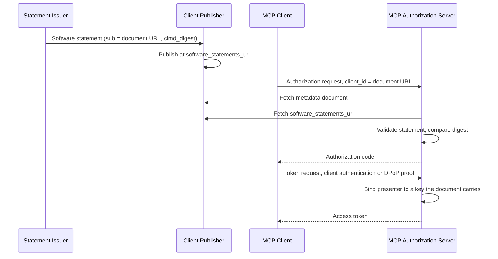

<Info>**Status**: Draft</Info>

<Note>This extension depends on draft-mcguinness-oauth-cimd-sw-stmt, cited here by its editor's copy until -00 is submitted. Its references will be pinned to that revision and to draft-ietf-oauth-client-id-metadata-document-02, and it will be proposed through the MCP SEP process.</Note>

## 1. Introduction

### 1.1 Purpose and Scope

This document defines an application of "[CIMD Software Statement](https://mcguinness.github.io/draft-mcguinness-oauth-software-statement-issuance/draft-mcguinness-oauth-cimd-sw-stmt.html)" for the Model Context Protocol (MCP). It lets an MCP authorization server admit an MCP client on the strength of a review by a party the server trusts, bound to the exact Client ID Metadata Document that party reviewed, without the client registering and, in the common case, without the client sending anything new.

MCP identifies clients by [Client ID Metadata Document](https://www.ietf.org/archive/id/draft-ietf-oauth-client-id-metadata-document-02.html) and has deprecated Dynamic Client Registration. A metadata document says what a client claims about itself. This profile adds who reviewed those claims, and lets a server tell whether the document it fetched today is the one that was reviewed.

A review answers a question about software: who vouched for this client, and against which bytes. It does not answer whether a particular user or organization may use the client right now. Where an enterprise identity provider mediates access, [Enterprise-Managed Authorization](https://github.com/modelcontextprotocol/ext-auth/blob/main/specification/stable/enterprise-managed-authorization.mdx) answers that second question, and this profile composes with it (Section 5).

The benefits:

- For MCP server operators, a client a trusted party has reviewed can be admitted without per-client onboarding, and a change to its document after review is detected rather than silently accepted.
- For enterprise administrators, a security team, a client catalog, or a server vendor's marketplace can vouch for agent software once, and every MCP authorization server that trusts that reviewer honours the decision until it expires or is withdrawn.
- For MCP client publishers, being reviewed requires publishing statements at a URL the client's own metadata document names. Most MCP clients change nothing; a public client with `https` redirection URIs that wants reviewed admission adds a DPoP key (Section 3.3).

### 1.2 Roles and Terminology

This document uses the terms of CIMD Software Statement. In the context of this profile:

- The **MCP Client** is the client, identified by its Client ID Metadata Document URL.
- The **Client Publisher** operates the Client ID Metadata Document and the location where the client's statements are published.
- The **Statement Issuer** is an issuing authorization server: a party that reviews client software and signs software statements about it.
- The **MCP Authorization Server** is the trusting authorization server that issues access tokens for an MCP Server, as advertised in the MCP Server's Protected Resource Metadata ([RFC9728](https://datatracker.ietf.org/doc/html/rfc9728)).

A **pulled statement** is one the MCP Authorization Server retrieves from the location the client's document names, rather than one the client sends in a request.

The key words **MUST**, **MUST NOT**, **REQUIRED**, **SHOULD**, **SHOULD NOT**, **RECOMMENDED**, **MAY**, and **OPTIONAL** are to be interpreted as described in BCP 14 ([RFC2119](https://datatracker.ietf.org/doc/html/rfc2119), [RFC8174](https://datatracker.ietf.org/doc/html/rfc8174)) when, and only when, they appear in all capitals.

## 2. Overview

1. A Statement Issuer reviews the MCP Client's metadata document and signs a software statement naming the document's URL and the digest of its exact bytes.
2. The Client Publisher publishes the statement at the URL its metadata document names in `software_statements_uri`.
3. The MCP Client starts an ordinary MCP authorization flow, with its metadata document URL as `client_id`.
4. The MCP Authorization Server resolves the metadata document, as MCP already requires, then retrieves the published statements, keeps those from issuers it trusts that name the document it just fetched, and validates them.
5. The server binds the presenter: by the client's key at the token endpoint for a confidential client, or by the reviewed redirection URIs and a DPoP key for a public client. It then admits the client as reviewed, or, where the client cannot be bound, as an unreviewed client.

### 2.1 Sequence Diagram



## 3. MCP Client and Client Publisher Requirements

### 3.1 Identity

The MCP Client **MUST** use its Client ID Metadata Document URL as its `client_id`, as MCP already requires. This profile defines no registration step, and an MCP Client following it does not use Dynamic Client Registration.

### 3.2 Publishing Statements

A Client Publisher that wants its client admitted as reviewed **MUST** include the `software_statements_uri` member in the client's metadata document and serve the client's current statements there, as [Pulled Statements](https://mcguinness.github.io/draft-mcguinness-oauth-software-statement-issuance/draft-mcguinness-oauth-cimd-sw-stmt.html#pulled-statements) defines: an `https` URL returning a JSON object whose `software_statements` member is an array of statements.

The Client Publisher **SHOULD** replace each statement before it expires, by renewal or reissuance from its Statement Issuer, and **SHOULD** remove statements that have expired or been withdrawn. Statements for MCP use need no `consumable_at`: without it a statement is usable only by presentation, so a published copy cannot be used to register the software. MCP has deprecated Dynamic Client Registration, and a server admitting a client under this profile does not register it.

The URL is part of the metadata document, and so part of what a statement's digest covers. Changing it, like changing any byte of the document, leaves every published statement naming a document that is no longer served.

### 3.3 Client Authentication and Binding

How the MCP Authorization Server binds a request to the reviewed software depends on the client:

- A **confidential client** **MUST** authenticate at the token endpoint with `private_key_jwt` ([RFC7523](https://datatracker.ietf.org/doc/html/rfc7523)), using a key its metadata document carries in `jwks` or at `jwks_uri`, and its redirection URIs **MUST** all use `https` with a host that is not a loopback address or `localhost`. A document declaring `private_key_jwt` beside a loopback redirect ships its key in every copy, and its statements are review-only (Section 4.4).
- A **public client whose redirection URIs all use `https` with a non-loopback host** **MUST** use PKCE with `S256`, **MUST** send `dpop_jkt` in its authorization request, and **MUST** prove that key with DPoP ([RFC9449](https://datatracker.ietf.org/doc/html/rfc9449)) when redeeming the code.
- A **client with any loopback redirection URI**, as desktop MCP clients commonly have, whatever authentication method its document declares, cannot be bound to the reviewed software, because another application on the same device can claim the redirect. Such a client needs nothing beyond MCP's existing requirements. Its statements are treated as review-only (Section 4.4).

### 3.4 Presenting Statements in a Request

An MCP Client **MAY** also present a statement in a token request or pushed authorization request, where the MCP Authorization Server advertises `software_statement_presentation_supported`. This profile does not require it, and an MCP Client that only publishes is fully conformant.

## 4. MCP Authorization Server Requirements

### 4.1 Pulled Statements

An MCP Authorization Server implementing this profile **MUST** support pulled statements and advertise `software_statement_pull_supported` as `true` in its authorization server metadata. It retrieves a client's `software_statements_uri` when it resolves the client's metadata document, at the authorization endpoint or the token endpoint, and processes what it finds as Pulled Statements specifies: it considers only statements naming the document's URL, from issuers it trusts, that validate, that permit presentation, and whose digest matches the document it fetched.

It **MAY** also accept presented statements.

### 4.2 Issuer Trust

The MCP Authorization Server **MUST** accept statements only from Statement Issuers it has configured, as [Issuer Trust Establishment](https://mcguinness.github.io/draft-mcguinness-oauth-software-statement-issuance/draft-mcguinness-oauth-cimd-sw-stmt.html#issuer-trust) requires, and **SHOULD** limit each issuer to the client identifier namespaces it is expected to vouch for. It obtains each issuer's statement signing keys from the issuer's `software_statement_jwks_uri`, never from a statement or the client's document.

### 4.3 Admission

A statement that passes validation, names the document the server fetched, and is bound to the presenter (Section 3.3) admits the client as reviewed for that grant. The server applies the reviewed document's metadata to the request: its redirection URIs and grant types bound the request, and its `scope`, where present, is a ceiling on what may be requested. MCP Servers announce the scopes each resource needs in `WWW-Authenticate` challenges, so an MCP Client's document **SHOULD** omit `scope`; an omitted `scope` sets no ceiling beyond the server's own policy. At the authorization endpoint the binding completes only at code redemption, so the server **MAY** show the reviewer on its consent screen only where no redirection URI in the document can be claimed by another application and that binding can complete: the document declares `private_key_jwt`, or the request carries `dpop_jkt`. No token is issued unless redemption proves the key.

The MCP Authorization Server **MUST NOT** require an MCP Client it admits under this profile to register. Where no statement remains after retrieval, or retrieval does not complete, the server applies the policy it applies to any Client ID Metadata Document client it has not reviewed. A retrieval failure is never treated as a withdrawal.

Where the server resolves statement status, a withdrawn statement ends refresh for the grants it opened, as CIMD Software Statement requires.

MCP requires access tokens in the `Authorization: Bearer` header. Where a public client binds a DPoP key at redemption, the MCP Authorization Server **MUST** issue the access token with a `token_type` of `Bearer` and bind only the refresh token to that key, as [Section 5 of RFC9449](https://datatracker.ietf.org/doc/html/rfc9449#section-5) permits, unless it knows the MCP Server accepts DPoP-bound access tokens.

### 4.4 Review-Only Clients

For a client whose document carries any loopback redirection URI, whatever authentication method it declares, and for a public client opening a new grant at the token endpoint without an established presenter binding, a statement is review-only. Code redemption and refresh continue a grant whose binding was established at the authorization endpoint, and keep it. The MCP Authorization Server:

- **MUST** treat the client exactly as an unreviewed Client ID Metadata Document client, and **MUST NOT** let the statement satisfy a policy that requires reviewed software;
- **MUST NOT** present the review to the user as an assurance about the application requesting access;
- **MAY** record the statement's issuer for audit and inventory, and **MAY** refuse the request where the statement's status shows a withdrawal.

### 4.5 Tenants

A multi-tenant MCP Authorization Server **MUST** resolve which tenant a request belongs to by its own means, such as a per-tenant endpoint or issuer identifier, or from a signed assertion it has validated, before evaluating any statement, and **MUST NOT** take the tenant from a value the client chooses. It rejects a statement whose `aud_tenant` names a different tenant. Where it configures a customer's own Statement Issuer for a tenant, it records the client identifier namespaces for which that issuer's decision is required there; for those clients only that issuer's statement establishes reviewed software in the tenant, so withholding it cannot fall back on a broader listing. A statement carrying `aud_tenant` discloses the customer that approved the client when published, so it is presented rather than published.

A statement says nothing about which of a client's own customers a request is for. An MCP Client that acts for many organizations under one metadata document presents the same review for all of them.

### 4.6 Errors

Where the server's policy requires reviewed software, it responds in the authorization error response, after validating the redirection URI against the client's metadata document, with:

- `statement_required` where no statement is established for a client that could be reviewed;
- `unauthorized_client` where the client is review-only (Section 4.4), since no statement can make it reviewed; and
- `temporarily_unavailable` where retrieving the client's statements did not complete.

Many MCP clients will not recognize `statement_required`, so the server **SHOULD** include an `error_description` a person can act on. It **MUST NOT** name the reviewers it accepts, since the request is unauthenticated and CIMD Software Statement keeps issuer trust from unauthenticated requesters.

## 5. Composition with Enterprise-Managed Authorization

Under Enterprise-Managed Authorization, the MCP Client exchanges the user's identity assertion at the enterprise identity provider for an ID-JAG, and presents it to the MCP Authorization Server with the `urn:ietf:params:oauth:grant-type:jwt-bearer` grant, using its metadata document URL as `client_id` where it is not pre-registered.

That request is one this profile covers. The MCP Authorization Server validates the ID-JAG as Enterprise-Managed Authorization specifies and retrieves and validates the client's statements as Section 4 specifies. The two answer different questions:

| Question | Answered by |
| --- | --- |
| May this user use this MCP Client with this MCP Server, now? | The ID-JAG, issued under the enterprise identity provider's policy, per grant |
| Who reviewed this MCP Client's software, and against which bytes? | The software statement, verified against the digest of the document the server fetched |

Neither carries what the other does. Where the identity provider mediates every grant and an organization only wants to allow or block clients, it can do so in identity provider policy, and a statement adds nothing it needs. A statement earns its place where the reviewer is not the identity provider, such as a client catalog or a server vendor's marketplace, or where a client acts with no user present and there is no ID-JAG.

On a `jwt-bearer` request a confidential MCP Client is bound by authenticating with `private_key_jwt` using a key its document carries. A public client on that request has nothing to bind the review to, so its statement is review-only (Section 4.4). The Identity Assertion JWT Authorization Grant requires the ID-JAG's `client_id` claim to match the authenticated client making the request ([Section 4.4.1](https://www.ietf.org/archive/id/draft-ietf-oauth-identity-assertion-authz-grant-04.html#section-4.4.1)), so for an MCP Client identified by its metadata document URL, the ID-JAG, the request's `client_id`, and the statement's `sub` all name that URL. That holds where the identity provider issues the ID-JAG with the metadata document URL as `client_id`, which is the identity provider's configuration rather than a consequence of this profile; an ID-JAG naming the client otherwise fails as that specification requires. Where the server's policy requires both, both checks **MUST** pass, and neither substitutes for the other. A server with a single endpoint takes the tenant from the validated ID-JAG, and that one tenant drives the statement's `aud_tenant` check, the required-issuer lookup, and the token's scope; any disagreement rejects the request.

## 6. Discovery

An MCP Client needs no discovery to participate: publishing `software_statements_uri` is enough. An MCP Authorization Server indicates support for this profile by advertising `software_statement_pull_supported` as `true`. A client that wants to present statements in a request checks `software_statement_presentation_supported`.

## 7. Examples

The examples are non-normative, and their key, digest, and identifier values are illustrative.

### 7.1 Client ID Metadata Document

A hosted agent, a confidential client, publishing its statements:

```json
{
  "client_id": "https://agent.example.com/oauth/client.json",
  "client_name": "Example Agent",
  "redirect_uris": ["https://agent.example.com/oauth/callback"],
  "grant_types": ["authorization_code", "refresh_token"],
  "response_types": ["code"],
  "token_endpoint_auth_method": "private_key_jwt",
  "jwks_uri": "https://agent.example.com/oauth/jwks.json",
  "scope": "tools.read tools.write",
  "software_statements_uri": "https://agent.example.com/oauth/statements.json"
}
```

### 7.2 Published Statements

The response from `software_statements_uri`:

```json
{
  "software_statements": [
    "eyJ0eXAiOiJzb2Z0d2FyZS1zdGF0ZW1lbnQrand0IiwiYWxnIjoiRVMyNTYiLCJraWQiOiJyZXZpZXctMSJ9..."
  ]
}
```

The decoded payload of that statement. It names no `aud` because it is a catalog listing, honoured wherever the catalog is trusted, and it carries no `consumable_at`, so it is usable only by presentation and a copy cannot register the software elsewhere:

```json
{
  "iss": "https://catalog.example",
  "sub": "https://agent.example.com/oauth/client.json",
  "iat": 1791273600,
  "exp": 1793865600,
  "jti": "b8f3c0d2-4a1e-4c5e-9a77-2f0d6c1e5b10",
  "cimd_digest": "y2Wl0H4k7dE5tq3m3nB4mJ8pCq9sV1rT6uX0aZbC2dE",
  "status": {
    "status_list": {
      "idx": 4117,
      "uri": "https://catalog.example/status/1"
    }
  }
}
```

### 7.3 Authorization Request

A public client with an `https` redirection URI, binding a DPoP key (line breaks for display only):

```
GET /authorize?response_type=code
  &client_id=https%3A%2F%2Fapp.example.com%2Foauth%2Fclient.json
  &redirect_uri=https%3A%2F%2Fapp.example.com%2Foauth%2Fcallback
  &code_challenge=E9Melhoa2OwvFrEMTJguCHaoeK1t8URWbuGJSstw-cM
  &code_challenge_method=S256
  &dpop_jkt=NzbLsXh8uDCcd-6MNwXF4W_7noWXFZAfHkxZsRGC9Xs
  &resource=https%3A%2F%2Fmcp.example.com%2F
  &state=af0ifjsldkj HTTP/1.1
Host: as.example.com
```

The server resolves the metadata document, retrieves its statements, and completes the binding when redemption proves the `dpop_jkt` key. It issues a Bearer access token and binds the refresh token to that key (Section 4.3).

### 7.4 Error Response

A review-only desktop client where the server requires reviewed software:

```
HTTP/1.1 302 Found
Location: http://127.0.0.1:33418/callback?error=unauthorized_client
  &error_description=This%20client%20cannot%20be%20reviewed%20here
  &state=af0ifjsldkj
  &iss=https%3A%2F%2Fas.example.com
```

## 8. Security Considerations

### 8.1 What a Review Does Not Say

A statement vouches for software and the metadata a reviewer evaluated. It does not prove that the party making a request is running that software; the binding in Section 3.3 does that, and where no binding is possible the statement is review-only. It does not say that a user or organization permits the client, which Enterprise-Managed Authorization or the server's own policy decides.

### 8.2 Loopback Clients

MCP's own example metadata document is a public client redirecting to loopback addresses. Any application on the same device can listen there, so a review of such a client's metadata cannot be attributed to the application presenting it. Treating these statements as review-only keeps desktop clients able to participate without letting a review stand in for an impersonator.

### 8.3 Changing the Document

A statement binds the exact bytes of the metadata document. Any change, including one that touches no security-relevant member, leaves published statements naming a document no longer served, and the client is unreviewed until its Statement Issuer reviews the new document. Client Publishers should plan document changes with their Statement Issuers. A change that alters keys, redirection URIs, or scope warrants fresh review in any case.

### 8.4 The Publication Location

Whoever controls `software_statements_uri` can withhold statements, which leaves the client unreviewed, but cannot forge them, since every statement is signed by a Statement Issuer and names the document's digest. Serving an expired or withdrawn statement gains nothing, since the server checks expiry and, where it resolves it, status.

Withdrawal is not a denylist. A publisher that stops serving a withdrawn statement leaves its client unreviewed, and where the server's policy admits unreviewed clients the withdrawal changes nothing there. A server that must keep withdrawn software out requires reviewed software, or a customer's own issuer for the tenant (Section 4.5).

### 8.5 Further Considerations

The security and privacy considerations of CIMD Software Statement apply, including those on issuer trust, statement key compartments, multi-tenant consumers, status resolution, and external retrieval.
