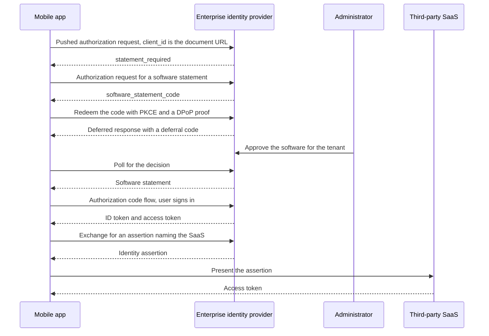

# Sketch: A Mobile App from Install to Third Party

A non-normative walkthrough of one scenario end to end: an employee installs an app from an app store, the enterprise identity provider refuses it as unreviewed, the app obtains a software statement and waits for an administrator, signs the user in, and then reaches a third-party SaaS through an identity assertion. It exercises all three drafts in this repository plus the Identity Assertion Authorization Grant.

It is the case the family serves least well, and this document does not smooth that over. What it still cannot give a mobile install is at the end.

## The cast

| Party | Role here |
| --- | --- |
| The app | A public client on a phone, one install among many, identified by a Client ID Metadata Document URL compiled into it |
| The publisher | Hosts that document and nothing else in this flow |
| The enterprise identity provider | The authorization server the employee signs in to, and also the reviewer that issues statements |
| The administrator | Approves the software for the tenant, out of band |
| The third-party SaaS | A separate authorization server the app reaches on the user's behalf |

## Two reviews, and only one of them travels

The app store already reviewed this app before listing it. That review is real, but it is not portable and the enterprise identity provider cannot consume it: there is no artifact, no digest, and no way to ask whether it still stands. The enterprise's question is a different one anyway, since it is deciding whether its own people may use this software against its own tenant. This is the same two-review distinction the deployment model opens with, arriving from the other end.

## Walkthrough

### 1. Install

The app ships with its client identifier, an HTTPS URL the publisher hosts. The document there carries `client_name`, `logo_uri`, `redirect_uris`, `token_endpoint_auth_method` of `none`, and the grant types and scopes the software uses. It carries no key material, because a private key inside a distributed binary is in every copy and identifies the software rather than the installation.

### 2. First sign-in, refused

The app sends a pushed authorization request to the enterprise identity provider with its Client ID Metadata Document URL as `client_id`. The server resolves the document and finds no statement from a reviewer it trusts for this tenant. It answers `statement_required`.

That error is the whole point of this step, and it only arrives if the app used a pushed authorization request. `statement_required` is registered for the token, pushed authorization request, and registration management responses. A plain authorization request has no code that says a statement is what is missing, so an app that skips PAR learns only that it is unauthorized. See the open questions.

### 3. Asking for a statement

The app reads the identity provider's authorization server metadata to find that it issues statements, then sends an authorization request:

| Parameter | Value |
| --- | --- |
| `response_type` | `software_statement_code` |
| `client_id` | the same Client ID Metadata Document URL |
| `redirect_uri` | an HTTPS universal or app link |
| `code_challenge_method` | `S256`, with `code_challenge` and `state` |
| `dpop_jkt` | the thumbprint of a key the app generated on the device |
| `completion_mode` | includes `deferred`, hinting that the decision may not be immediate |
| `audience` | the third-party SaaS authorization server, so the statement is usable there too |

Two constraints bite here. A public client must use an HTTPS redirection URI in a statement request and may not use a private-use scheme or a loopback address, so the app needs universal links or app links for this flow specifically. And `dpop_jkt` is required for a public client, so the app proves possession of a key it generated itself.

### 4. Approval happens out of band

The employee authenticates and the identity provider returns a `software_statement_code` to the redirect. The app redeems it at the token endpoint under `grant_type=urn:ietf:params:oauth:grant-type:software-statement`, with its PKCE verifier and a DPoP proof.

Nobody has approved this software yet, so the identity provider answers with a Deferred Token Response carrying a deferral code, and the app polls. The administrator approves in the console minutes or days later.

### 5. The statement arrives

A later poll returns the statement as `access_token`, with `issued_token_type` of `urn:ietf:params:oauth:token-type:software-statement` and `token_type` of `N_A`. It names the identity provider as `iss`, the document URL as `sub`, the digest of the exact octets reviewed as `cimd_digest`, an audience covering both authorization servers, an expiry, and a `status` reference if this issuer publishes status.

### 6. Admitted, without presenting anything

The identity provider issued this statement, so it already holds the decision. It admits the client on its own record rather than requiring the statement to be handed back.

Holding the record does not save it the checks. It confirms the decision is unexpired and its status current, re-reads the document at `sub`, and compares the digest against the one it recorded. A decision it made is not a document it has re-read, and the app's metadata may have changed since.

No registration is created. The app's `client_id` stays its Client ID Metadata Document URL.

### 7. If the reviewer were somebody else

Had the review come from an app marketplace rather than from the enterprise, the identity provider would hold no record and the app would have to present the statement. A public client cannot prove a key its document carries, so the binding is the reviewed document's redirection URIs together with PKCE: an authorization code opened by the presentation is delivered only to a URI the reviewer looked at. That is why every such URI must use `https`, since a private-use scheme or loopback address can be claimed by other software on the same device.

The app's own device key, the one `dpop_jkt` already required during issuance, becomes the Proven Key of the establishment. Code redemption and refresh re-prove it. Software identity comes from the statement and the document, instance binding comes from the app's key, and the two no longer have to be the same key.

This path exists at the pushed authorization request endpoint only. At the token endpoint there is no redirect to bind, so a public client's statement is refused there.

### 8. Sign-in succeeds

The app runs an ordinary authorization code flow, with PKCE and tokens bound to its device key. The user signs in.

### 9. Reaching the third party

The app needs data in a third-party SaaS. It exchanges its identity provider token for an Identity Assertion Authorization Grant assertion naming that SaaS, and presents the assertion at the SaaS authorization server for an access token.

One act carries two decisions. The assertion says this user, at this enterprise, authorizes this client at this target, and the fact that it was issued at all says the enterprise permits this software. An application the administrator has not approved receives no assertion.

A proposed optional `cimd_digest` claim in that assertion would let the SaaS resolve the app's document, compare the digest, and provision just in time with no registration of its own. That is a proposal on an open issue, not settled work.

### 10. Offboarding

The administrator withdraws approval. The identity provider sets the statement's status and stops renewing. No further establishment is admitted, and open grants end at their next currency check where refresh requires a current decision. New assertions stop at once, so third-party access ends at the next grant. Access tokens already issued run out on their own clock.

## The flow

## What each step relies on

| Step | Draft | Section |
| --- | --- | --- |
| Refusal at first sign-in | Statement | Error Responses |
| Requesting a statement | Issuance | Software Statement Authorization Request |
| Waiting for an administrator | Issuance | Deferred Processing |
| Receiving the statement | Issuance | Software Statement Token Response |
| Admission without presentation | Statement | Issuer and Consumer as One Server |
| Presenting as a public client | Statement | Public Clients |
| Binding the grant to one install | Statement | Grant Lifecycle |
| Withdrawal before expiry | Statement, Issuance | `status` claim, Status Publication |
| Reaching the third party | Not in this family | Identity Assertion Authorization Grant |

## What is still missing

Neither path above gives the installation a cryptographic identity. The device key binds a grant to whichever phone opened it, but nobody vouches for that key, so the authorization server learns that the same installation came back and never learns which installation it is.

**Endorsing the instance's own key** is what would supply that. The app already holds a device-generated key and platform attestation could vouch for it. The statement draft names this as an extension point: a client attestation, or an assertion from an issuer named by an `instance_issuers` delegation in the reviewed document, vouching for a key the document does not carry. With it the presenter proof means something about the device rather than only about continuity, which is what a deployment wants before it treats one install differently from another. It is not defined yet.

The weaker binding is a deliberate trade rather than an oversight. The alternative for software distributed to end users is a key in every copy, which proves nothing about the installation holding it.

## Open questions

* **The refusal needs a home outside PAR.** `statement_required` is not registered for the authorization endpoint, so an app that does not use pushed authorization requests cannot be told what it is missing. Either the family requires PAR for this interaction and says so, or it needs a way to signal the same thing to a plain authorization request.
* **Nothing tells the app where to go after the refusal.** It has to already know that this authorization server issues statements and that it is the right reviewer for its own admission. An error carrying that pointer would close the loop, and the family deliberately withholds issuer-trust detail from unauthenticated requesters, so the two goals are in tension.
* **What a copied statement is worth against a public client.** It opens a consent prompt wearing the reviewed software's branding, raised by a party that cannot receive what the user approves. Bounded, but not nothing, and rate limiting is the only control named.
* **Whether the enterprise identity provider should be the reviewer at all** in this scenario, or whether the app store's review should be the thing that travels, which would need an artifact no app store publishes today.
