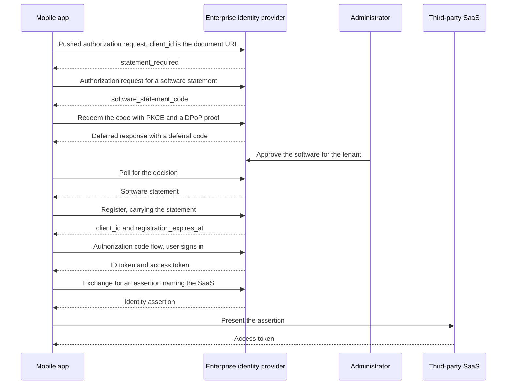

# Sketch: A Mobile App from Install to Third Party

A non-normative walkthrough of one scenario end to end: an employee installs an app from an app store, the enterprise identity provider refuses it as unreviewed, the app obtains a software statement and waits for an administrator, signs the user in, and then reaches a third-party SaaS through an identity assertion. It exercises all three drafts in this repository plus the Identity Assertion Authorization Grant.

It is also the case the family serves least well, and this document does not smooth that over. The break is at step 6.

## The cast

| Party | Role here |
| --- | --- |
| The app | A public client on a phone, one install among many, identified by a Client ID Metadata Document URL compiled into it |
| The publisher | Hosts that document and nothing else in this flow |
| The enterprise identity provider | The authorization server the employee signs in to, and also the reviewer that issues statements |
| The administrator | Approves the software for the tenant, out of band |
| The third-party SaaS | A separate authorization server the app reaches on the user's behalf |

## Two reviews, and only one of them travels

The app store already reviewed this app before listing it. That review is real, but it is not portable and the enterprise identity provider cannot consume it: there is no artifact, no digest, and no way to ask whether it still stands. The enterprise's question is a different one anyway, since it is deciding whether its own people may use this software against its own tenant. This is the same two-review distinction the deployment model opens with, arriving from the other end.

## Walkthrough

### 1. Install

The app ships with its client identifier, an HTTPS URL the publisher hosts. The document there carries `client_name`, `logo_uri`, `redirect_uris`, `token_endpoint_auth_method` of `none`, and the grant types and scopes the software uses. It carries no key material, because a private key inside a distributed binary is in every copy and identifies the software rather than the installation.

### 2. First sign-in, refused

The app sends a pushed authorization request to the enterprise identity provider with its Client ID Metadata Document URL as `client_id`. The server resolves the document and finds no statement from a reviewer it trusts for this tenant. It answers `statement_required`.

That error is the whole point of this step, and it only arrives if the app used a pushed authorization request. `statement_required` is registered for the token, pushed authorization request, and registration management responses. A plain authorization request has no code that says a statement is what is missing, so an app that skips PAR learns only that it is unauthorized. See the open questions.

### 3. Asking for a statement

The app reads the identity provider's authorization server metadata to find that it issues statements, then sends an authorization request:

| Parameter | Value |
| --- | --- |
| `response_type` | `software_statement_code` |
| `client_id` | the same Client ID Metadata Document URL |
| `redirect_uri` | an HTTPS universal or app link |
| `code_challenge_method` | `S256`, with `code_challenge` and `state` |
| `dpop_jkt` | the thumbprint of a key the app generated on the device |
| `completion_mode` | includes `deferred`, hinting that the decision may not be immediate |
| `audience` | the third-party SaaS authorization server, so the statement is usable there too |

Two constraints bite here. A public client must use an HTTPS redirection URI in a statement request and may not use a private-use scheme or a loopback address, so the app needs universal links or app links for this flow specifically. And `dpop_jkt` is required for a public client, so the app proves possession of a key it generated itself.

### 4. Approval happens out of band

The employee authenticates and the identity provider returns a `software_statement_code` to the redirect. The app redeems it at the token endpoint under `grant_type=urn:ietf:params:oauth:grant-type:software-statement`, with its PKCE verifier and a DPoP proof.

Nobody has approved this software yet, so the identity provider answers with a Deferred Token Response carrying a deferral code, and the app polls. The administrator approves in the console minutes or days later.

### 5. The statement arrives

A later poll returns the statement as `access_token`, with `issued_token_type` of `urn:ietf:params:oauth:token-type:software-statement` and `token_type` of `N_A`. It names the identity provider as `iss`, the document URL as `sub`, the digest of the exact octets reviewed as `cimd_digest`, an audience covering both authorization servers, an expiry, and a `status` reference if this issuer publishes status.

### 6. The break

The app now holds a valid statement and still cannot use it to sign in.

Runtime presentation requires the presenter to prove possession of a key the reviewed document carries. This document carries none, by design, and the specification is explicit about the consequence: a statement whose reviewed document carries no key material cannot be presented at runtime and is consumable only through registration.

The awkward part is that the app does hold a proven key. It generated one for the issuance flow and `dpop_jkt` required it. That key is the app's own and is not in the document, which is exactly the key runtime presentation refuses. The issuance half of the family accepts an instance key and the consumption half does not.

### 7. Registration, once per installation

Registration is the only remaining door. The app registers under RFC 7591 carrying the statement. The identity provider takes every metadata value from the reviewed document and none from the request, and returns a local `client_id` and a `registration_expires_at` bounded by the statement's expiry.

The identity provider has to raise a bound deliberately to allow this. The safe default is one registration per issuer and subject at one server, counted across replacements, and a mobile fleet means one per installation. Raising it is a policy decision about this software, not a default.

There is an upside worth naming. Each installation's registration expires with the review behind it, so an app deleted from a phone, or a device that stops checking in, ages out on its own rather than leaving a permanent registration behind.

### 8. Sign-in succeeds

The app runs an ordinary authorization code flow with its newly registered `client_id`, PKCE, and DPoP-bound tokens. The user signs in.

### 9. Reaching the third party

The app needs data in a third-party SaaS. It exchanges its identity provider token for an Identity Assertion Authorization Grant assertion naming that SaaS, and presents the assertion at the SaaS authorization server for an access token.

One act carries two decisions. The assertion says this user, at this enterprise, authorizes this client at this target, and the fact that it was issued at all says the enterprise permits this software. An application the administrator has not approved receives no assertion.

A proposed optional `cimd_digest` claim in that assertion would let the SaaS resolve the app's document, compare the digest, and provision just in time with no registration of its own. That is a proposal on an open issue, not settled work.

### 10. Offboarding

The administrator withdraws approval. The identity provider sets the statement's status and stops renewing. Each installation's registration lapses at its recorded expiry, or sooner where the provider resolves status. New assertions stop immediately, so third-party access ends at the next grant. Access tokens already issued run out on their own clock.

## The flow

## What each step relies on

| Step | Draft | Section |
| --- | --- | --- |
| Refusal at first sign-in | Statement | Error Responses |
| Requesting a statement | Issuance | Software Statement Authorization Request |
| Waiting for an administrator | Issuance | Deferred Processing |
| Receiving the statement | Issuance | Software Statement Token Response |
| Registering with it | Statement | Consumption at Registration |
| Registration expiring with the review | Statement | Registration Validity |
| Raising the per-installation bound | Statement | Registrations Derived from One Statement |
| Withdrawal before expiry | Statement, Issuance | `status` claim, Status Publication |
| Reaching the third party | Not in this family | Identity Assertion Authorization Grant |

## The way out of step 6

Two paths, one available and one not.

**Register per installation**, as above. It works today with no extension, and it costs a registration record per install at every authorization server the software touches. For an enterprise app with thousands of seats that is a large number of records whose only distinguishing feature is which phone they came from.

**Endorse the instance's own key**, which is what this case actually wants. The app already holds a device-generated key and platform attestation could vouch for it. The statement draft names this as an extension point: a client attestation, or an assertion from an issuer named by an `instance_issuers` delegation in the reviewed document, vouching for a key the document does not carry. With it, the app presents its statement at runtime, proves its own key, and no registration exists at all, which is the right shape for a fleet of installs. It is not defined yet.

Until then, mobile is the deployment where this family asks for the most and gives back the least.

## Open questions

* **The refusal needs a home outside PAR.** `statement_required` is not registered for the authorization endpoint, so an app that does not use pushed authorization requests cannot be told what it is missing. Either the family requires PAR for this interaction and says so, or it needs a way to signal the same thing to a plain authorization request.
* **Nothing tells the app where to go after the refusal.** It has to already know that this authorization server issues statements and that it is the right reviewer for its own admission. An error carrying that pointer would close the loop, and the family deliberately withholds issuer-trust detail from unauthenticated requesters, so the two goals are in tension.
* **The issuance and consumption halves disagree about instance keys.** Issuance requires a public client to bind an instance key it generated. Consumption refuses any key the reviewed document does not carry. Both rules are defensible alone.
* **Whether one statement should govern many registrations** or the per-installation bound should stay low and mobile should simply wait for the endorsement extension.
* **Whether the enterprise identity provider should be the reviewer at all** in this scenario, or whether the app store's review should be the thing that travels, which would need an artifact no app store publishes today.
