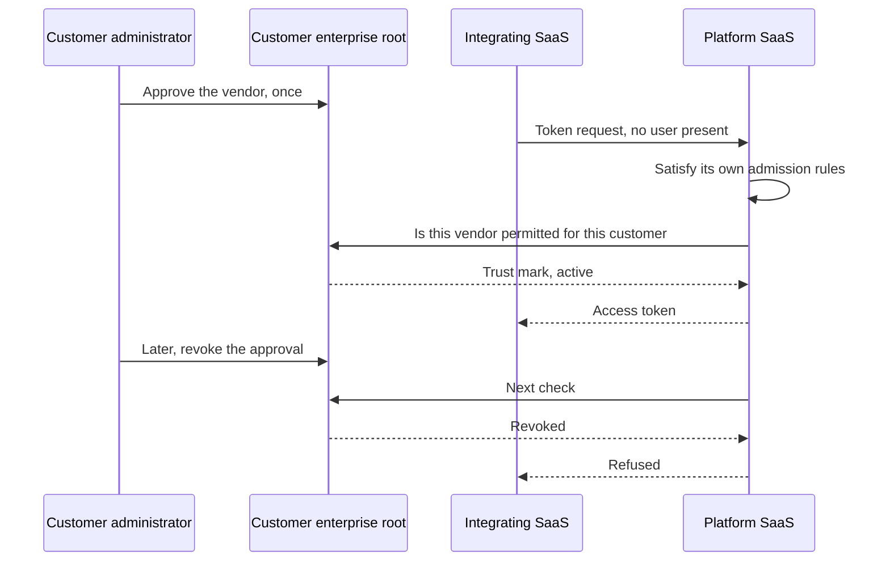

# Sketch: A Customer Approving a Vendor Integration at Their Own Root

A non-normative walkthrough of the case these drafts serve least well. One vendor's application integrates with another vendor's platform on a customer's behalf, with no user present while it runs.

The act being modelled is the customer's. An administrator approves the vendor once, at the enterprise root their organization already operates and the platform is already configured with, and every platform that trusts that root honours it. Whether the platform's own marketplace has separately reviewed and listed the integration is the platform's business. From the customer's side it is implementation detail.

**A ruling this sketch assumes.** The customer's permission is a decision these drafts deliberately do not carry, and the usual answer, that the customer's identity provider conveys it by issuing an assertion, is unavailable here because no user is present. This sketch has the customer's own root carry it, through OpenID Federation machinery the customer already operates. The family gains no artifact and the request carries no second review, which is the shape that was considered and rejected. Whether that distinction holds is the authors' call, and everything below depends on it.

## What is broken today

An administrator opens the integrating vendor's settings, clicks connect, and completes an authorization code flow against the platform. The vendor stores a refresh token.

That token then outlives the administrator's employment and often the commercial relationship. The customer has no inventory of which vendors hold one, and withdrawing means finding it in each platform's console separately, one vendor at a time. The customer's approval exists only as a side effect of a grant inside somebody else's system, so there is nothing for the customer to hold, expire, or audit.

It is the same defect as tenant-wide admin consent, arriving through a different door: a permanent record that nobody revisits, kept by the wrong party.

## The cast

| Party | Role here |
| --- | --- |
| The customer | Operates an enterprise root, a Federation trust anchor, and decides which vendors may act for the organization |
| The customer's administrator | Approves the vendor once, in the customer's own console |
| The integrating SaaS | Acts for many customers, identified by a Client ID Metadata Document URL |
| The platform SaaS | The authorization server the integration calls, already configured with this customer's root |

The platform's marketplace reviewer appears nowhere in this list on purpose. It matters to the platform and not to the customer.

## The customer's decision, and the platform's

| Question | Whose | Where it lives |
| --- | --- | --- |
| May this vendor act for my organization? | The customer's | Their own root, as a record they issue, expire, and revoke |
| May this software be a client here at all? | The platform's | Its own admission control, which these drafts serve with a software statement |

These are not two halves of one approval. They are separate questions with separate owners, and the platform would answer its own whether or not this customer existed. Keeping them apart is what leaves the customer with a decision they hold rather than a consent buried in a vendor's directory.

## Walkthrough

### 1. The root already exists

The platform is already configured with this customer's enterprise root. Most platforms hold such a relationship for single sign-on; here it is a Federation trust anchor whose public keys the platform has. Nothing is configured to make this particular integration possible, which is the point: the customer does not onboard an approval mechanism per vendor, and the platform does not onboard one per customer.

### 2. The customer approves, once, in their own console

An administrator approves the vendor at the customer's root. The root issues a trust mark whose type means permitted to act for this organization, with the vendor's entity identifier as `sub` and an expiry the customer chooses.

The mark stays at the customer's root. The vendor does not publish it in its own entity configuration, which would list every customer that had approved it, and which would also make the mark readable by anyone, since entity configurations are public and Federation's status endpoint asks only for a mark somebody already holds.

The approval names the platform tenant it applies in, using the `aud_tenant` claim the Identity Assertion Authorization Grant registers, so a customer running production and sandbox tenants at one platform can approve a vendor in one and not the other. A decision naming a tenant cannot be spent in a different one.

This is the whole of the customer's action, and it is the only artifact the customer has to reason about. It is not repeated per platform, which is the difference from consenting in each vendor's console.

### 3. The integration runs

The integrating SaaS makes a token request to the platform using client credentials or an assertion grant, since no user is present.

The platform, for its own reasons, satisfies itself that this software is admissible: it validates the marketplace statement the client presents, resolves the document at `sub`, and compares the digest. None of that is the customer's concern.

Then it answers the customer's question. It resolves which customer the request is for, authenticates to that customer's root and asks whether this vendor is permitted, querying by subject rather than enumerating the customer's vendors, and evaluates the request against the reviewed document, whose `scope` is the ceiling on what may be requested.

One rule governs all of this and the statement draft now carries it: the tenant the platform decides against and the tenant that scopes what it issues must be the same, and neither may be selected by a value the client supplies. Everything else here is arrangement; that is the part that keeps a vendor from reaching one customer's data on another customer's approval.

The platform pulls rather than having the client present the customer's trust mark. Presenting it would put two review artifacts from two authorities on one request, which is the arrangement this family rejected, and it would also make the customer's decision travel through the vendor it constrains.

### 4. Withdrawal, and the reason to do it this way

The customer revokes the trust mark at their own root. The platform's next check returns revoked and the integration stops being admitted.

**One revocation, everywhere.** Every platform configured with that root sees the same answer, so a customer offboarding a vendor acts once instead of hunting through each vendor's console. That is the strongest argument in this sketch and the one thing today's model cannot offer at any price.

Two clocks run independently and neither belongs to the other. The customer's approval expires on the customer's schedule, in that customer's tenants alone. The platform's own listing decision expires on the platform's schedule, everywhere in its audience. Neither reaches access tokens already issued.

## The flow

## What each part relies on

| Part | Where it comes from |
| --- | --- |
| The customer's root as an authority the platform already holds | [The Federation sketch](openid-federation-sketch.md), Profile A |
| The customer's approval as a Trust Mark they issue and revoke | [The Federation sketch](openid-federation-sketch.md), Profile B |
| The platform's own admission control | Statement draft, The Software Statement and Consumption at Registration |
| Acting with no user present | Statement draft, Runtime Presentation, on the client credentials or assertion grants |
| The document's `scope` as a ceiling | Statement draft, Reviewed Metadata |
| Nothing at all | The customer's per-tenant scope grant, which stays the platform's own policy |

## What is still missing

**The pull is supported, and the specification names this use case.** Federation's Trust Mark endpoint takes a subject as a required parameter and says a deployment "MAY choose to allow authenticated requests from clients that are not the Trust Mark subject," offering as its example a federation entity retrieving the trust mark for another entity. That is this scenario. The Trust Marked Entities Listing endpoint answers the same question when given a subject, and client authentication may be required at either through `private_key_jwt`, with the trust mark endpoint as the specification's own worked example of declaring it.

**What is wrong is the default and the privacy posture, not the mechanism.** Client authentication is not used at federation endpoints by default, and the specification defines no authorization model for them at all: authentication establishes who is asking, and nothing establishes who may ask about whom. Federation also treats trust-mark holdership as public federation infrastructure data. Its privacy considerations protect the verifier from being tracked by the issuer, and the mitigation they recommend is to fetch the whole list of entities holding a mark type instead of asking per subject.

For a customer's commercial approvals that is the wrong way round. Which vendors an enterprise has approved is competitively sensitive and useful to an attacker mapping its estate. A root carrying these approvals therefore has to require client authentication at its trust mark endpoint, decline to publish a listing endpoint at all, and enforce a query-authorization policy the specification does not describe. All three are permitted, none is the default, and the last has no interoperable form, so two roots will do it differently.

**No user means no assertion.** Everything the deployment model says about the customer's identity provider conveying permission per grant is unavailable here. That is why this case needed a third path, and why it remains the weakest scenario in the set.

**The trust mark type needs a namespace**, and the venue question is the one the signals draft and the Federation sketch both carry: the artifact and its digest are IETF work, Federation is OpenID Foundation work.

## Open questions

* **Tenant resolution is now a stated rule rather than a hole, but it is unenforceable from outside.** The statement draft carries the invariant and `aud_tenant` makes a tenant-scoped decision unspendable elsewhere, which is what closes the escalation. What neither does is let a customer or a vendor verify that a platform honoured it, since resolution stays the platform's own business and a client identifier URL is the same value in every tenant.
* **Does the customer need the platform to hold a root at all?** The whole shape depends on the platform already trusting this customer's anchor. A customer whose platforms do not is back to per-console approval, and nothing here bootstraps that relationship.
* **What does the customer see?** Nothing here gives the customer an inventory of which platforms have acted on its approvals, which is half of what an administrator wants from an approval record.
* **Is a trust mark the right artifact for a customer's own governance decision**, or is it being borrowed because it is the nearest thing that exists? It carries an issuer, a subject, and an expiry, which is what is needed, but its intended meaning is conformance to a trust framework rather than commercial permission.
